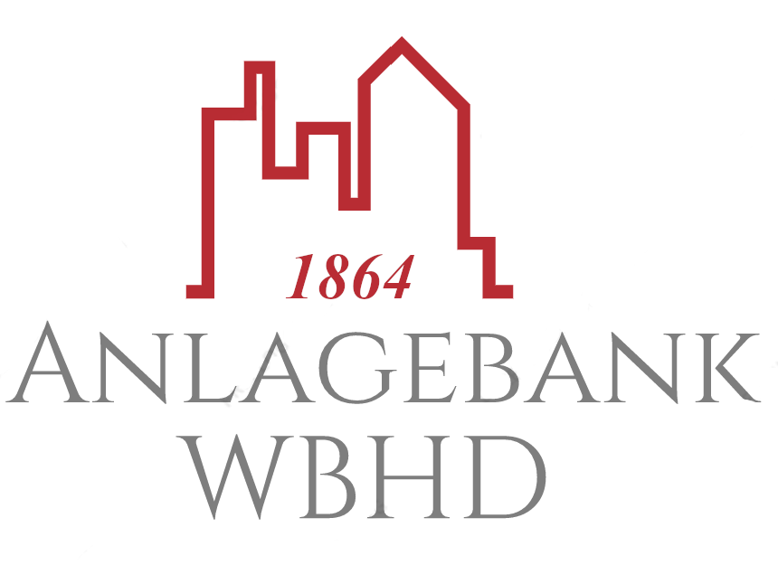

# FaceBank 

Lasse Deine Emotionen entscheiden, welches Produkt für Dich das richtige ist!🚀  
Mit der FaceBank-App wird die Finanzwelt revolutioniert! Anhand von Alter und Emotion, welche wir aus einem einzelnen Bild auslesen, wird dem Kunden in unserer App ein für ihn individuell passendes Finanzprodukt angeboten.

## Projekt

Die FaceBank-App und die Anlagebank WBHD sind ein Fallstudienprojekt des 3. Semester im Kurs WWI20DSB.  
Projektmitglieder:

- Antonino Piloro
- Florian Frey
- Frederick Neugebauer
- Mya-Melissa Jahic
- Oliver Hinkel

## Content

📦**FaceBank**  
┣ 📂**code**  
┃ ┗ Enthält den Code, welcher zum Testen des deepface-Modells verwendet wurde.  
┣ 📂**data**  
┃ ┣ Beinhaltet Bilder, welches zum Ausprobieren der FaceBank-App genutzt werden können.  
┃ ┗ Lokal werden hier auch weitere Testdaten abgelegt.  
┣ 📂**presentations**  
┃ ┗ Hier sind alle von uns gehaltenen Präsentationen zu finden.  
┣ 📂**ressources**  
┃ ┗ Einzelne Dokumente, welche in der Projektphase erstellt wurden.  
┣ 📂**sources**  
┃ ┗ Zusätzliche Inhalte und Quellen, die zum Bearbeiten der Aufgaben genutzt wurden.  
┣ 📂**videos**  
┃ ┗ Demos der App, unseres Instagram-Accounts und der Entwicklung.  
┣ 📜.gitignore  
┣ 📜logo.png  
┣ 📜README.md  
┣ 📜Vorgaben_Abgabe.pptx  
┗ 📜Vorgaben_Entwurf_Projekt_Business.pptx

## Instagram 

Besuche auch gerne unseren [Instagram-Account](https://www.instagram.com/facebankwbhd/)!
